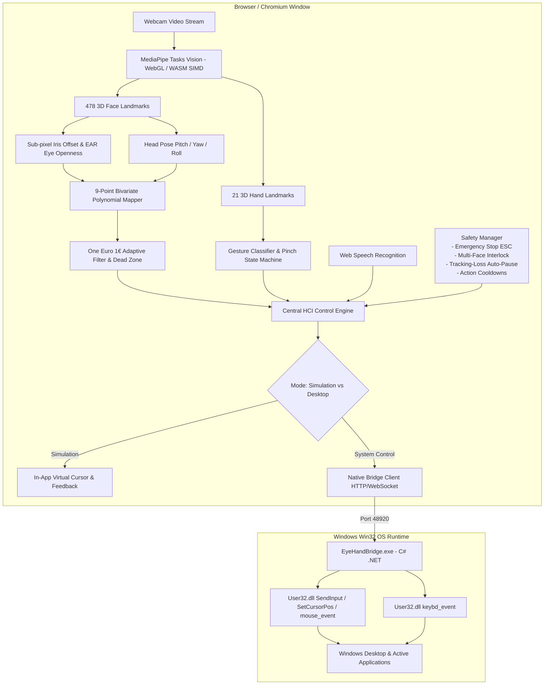

# EyeHand Architectural Deep Dive

## 1. System Architecture Diagram



---

## 2. Signal Processing & Filter Mathematics

### 2.1 One Euro (1€) Adaptive Filter
Eye tracking exhibits high-frequency jitter during gaze fixation, yet fast saccades require zero perceived latency. EyeHand implements the **One Euro Filter** (Casiez et al., CHI 2012):

$$\alpha = \frac{1}{1 + \frac{\tau}{T_e}}$$
$$\tau = \frac{1}{2\pi f_c}$$
$$f_c = f_{c,\text{min}} + \beta \cdot |\dot{x}|$$

Where:
* $f_{c,\text{min}}$ is the minimum cutoff frequency (set to 0.8–1.2 Hz) to eliminate micro-jitter during fixation.
* $\beta$ is the speed coefficient (0.02–0.04) that dynamically increases cutoff frequency during fast saccades.
* $\dot{x}$ is the filtered derivative of the coordinate signal.

### 2.2 Movement Dead Zone
To prevent micro-drift when looking at dense on-screen UI buttons, a dead zone threshold (3–6 pixels) suppresses coordinate outputs when distance moved between frames satisfies:

$$\Delta d = \sqrt{(x_t - x_{t-1})^2 + (y_t - y_{t-1})^2} < R_{\text{deadzone}}$$

---

## 3. 9-Point Bivariate Coordinate Calibration

Rather than assuming raw iris positions directly correspond to screen pixels, EyeHand executes a least-squares bivariate polynomial regression:

$$X_{\text{screen}} = a_0 + a_1 \cdot X_{\text{iris}} + a_2 \cdot Y_{\text{iris}} + a_3 \cdot \text{Yaw}_{\text{head}}$$
$$Y_{\text{screen}} = b_0 + b_1 \cdot X_{\text{iris}} + b_2 \cdot Y_{\text{iris}} + b_3 \cdot \text{Pitch}_{\text{head}}$$

Coefficients are computed across 9 screen reference points with gaze samples collected during fixation. Stability score is computed from residual variance:

$$\text{StabilityScore} = \max\left(0, \min\left(100, \left(1 - \frac{1}{N}\sum_{i=1}^N \|P_{\text{pred},i} - P_{\text{target},i}\|\cdot 2.5\right)\times 100\right)\right)$$

---

## 4. Pinch Hysteresis State Machine

A simple distance threshold causes rapid flickering clicks near the boundary. EyeHand implements an asymmetric hysteresis state machine:

```
          distance < PinchThreshold (e.g. 0.06)
  [NONE] -----------------------------------------> [PINCH_START]
    ^                                                    |
    |                                                    | time > 180ms
    | distance > ReleaseThreshold (0.08)                 v
  [PINCH_RELEASE] <-------------------------------- [PINCH_HOLD]
```

* **Click Event:** Dispatched exactly once upon entering `PINCH_START`.
* **Drag Event:** Dispatched when position moves $>4\%$ while remaining in `PINCH_HOLD`.
* **Release Event:** Dispatched upon entering `PINCH_RELEASE`.
